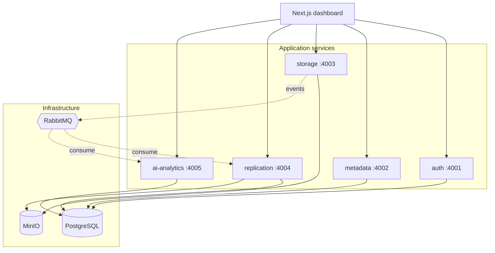

# IntelliStore — AI-Powered Distributed Storage Platform

A distributed file-storage platform inspired by Dropbox and Amazon S3, built as
a set of Node.js/TypeScript microservices and enhanced with an AI-flavored
analytics layer that classifies files hot/cold and surfaces storage
recommendations. It demonstrates distributed-systems patterns (chunking,
replication, heartbeat monitoring, self-healing), event-driven microservices,
and a full cloud-native path from `docker compose` to Kubernetes.

> **Status:** all 11 milestones complete. The platform (8 services + web +
> Postgres/Redis/RabbitMQ/MinIO) runs locally and on Kubernetes, verified
> end-to-end on minikube. `api-gateway` and `notification-service` are
> intentionally left as health-check-only skeletons (see
> [ARCHITECTURE](./docs/ARCHITECTURE.md#deliberate-simplifications)).

## Architecture at a glance



| Service | Port | Does |
| ------- | ---- | ---- |
| auth-service | 4001 | Users, bcrypt, JWT issue/verify |
| metadata-service | 4002 | Files / versions / chunks, ownership, stats |
| storage-service | 4003 | Chunk + hash uploads, MinIO persistence, reassembly |
| replication-service | 4004 | Replication, node heartbeats, self-healing |
| ai-analytics-service | 4005 | Hot/cold scoring, cross-service analytics |
| api-gateway / notification | 4000 / 4006 | Skeletons |
| web | 3000 | Next.js dashboard |

Full detail in **[docs/ARCHITECTURE.md](./docs/ARCHITECTURE.md)**.

## Repository layout

```
IntelliStore/
├── apps/web/                 # Next.js + TypeScript + Tailwind dashboard
├── services/                 # 7 microservices (see table above)
├── packages/
│   ├── shared-auth/          # JWT sign/verify
│   ├── shared-config/        # zod-validated env loading
│   ├── shared-logger/        # structured logging (pino)
│   ├── shared-queue/         # amqplib wrapper (publish/consume)
│   └── shared-types/         # cross-service TypeScript types
├── infra/k8s/                # Kubernetes manifests (Kustomize)
├── docs/                     # architecture, deployment, API reference
├── docker-compose.yml        # local infra: Postgres, Redis, RabbitMQ, MinIO
└── .env.example
```

## Quickstart (local)

```bash
npm install
cp .env.example .env
docker compose up -d          # Postgres, Redis, RabbitMQ, MinIO
npm run build

# run migrations (auth, metadata, replication, ai-analytics)
npm run migrate --workspace=@intellistore/auth-service
npm run migrate --workspace=@intellistore/metadata-service
npm run migrate --workspace=@intellistore/replication-service
npm run migrate --workspace=@intellistore/ai-analytics-service

# run services (each in its own terminal) + the frontend
npm run dev --workspace=@intellistore/auth-service   # ...4001–4005
npm run dev --workspace=@intellistore/web            # http://localhost:3000
```

Running on Kubernetes, image builds, env vars, and troubleshooting:
**[docs/DEPLOYMENT.md](./docs/DEPLOYMENT.md)**.

## Documentation

- **[Architecture](./docs/ARCHITECTURE.md)** — services, shared packages, data
  model, key flows (with diagrams), and the reasoning behind the design.
- **[Deployment & operations](./docs/DEPLOYMENT.md)** — local, Docker, and
  Kubernetes, plus env-var reference and troubleshooting.
- **[API reference](./docs/API.md)** — every endpoint across all services.

## Feature highlights

- **Chunked uploads with integrity checking** — files split into fixed-size
  chunks, each SHA-256 hashed; downloads reassemble and re-verify the whole-file
  checksum before responding.
- **Event-driven replication** — storage-service publishes to RabbitMQ;
  replication-service asynchronously copies chunks to `REPLICATION_FACTOR`
  least-used healthy nodes.
- **Heartbeat monitoring + self-healing** — a staleness sweep marks silent nodes
  unhealthy; a Kubernetes-controller-style reconciliation loop restores
  under-replicated chunks and retries across sweeps until a node is available.
- **AI hot/cold analytics** — a deterministic, explainable scoring heuristic
  (recency half-life + capped frequency), honestly *not* a trained model, with a
  cross-service overview and a real dashboard.
- **Cloud-native path** — one repo runs via `docker compose` locally and as a
  full Kubernetes deployment (Deployments, StatefulSet, ConfigMap/Secret,
  migration Jobs).

## Engineering standards

- Repository pattern per service; business logic unit-tested against in-memory
  fakes (no DB/network needed), with Postgres implementations for production.
- Strict TypeScript across the monorepo (`tsconfig.base.json`).
- Centralized env validation, structured logging, consistent error envelopes.
- Every milestone was independently runnable and verified end-to-end (unit
  tests **and** a live run against real infra) before the next began.

## Milestones

1. Monorepo scaffold *(done)*
2. JWT authentication service *(done)*
3. Metadata service for file tracking *(done)*
4. Chunk upload pipeline *(done)*
5. MinIO object storage integration *(done)*
6. Replica manager *(done)*
7. Distributed node heartbeat monitoring *(done)*
8. Automatic self-healing replication *(done)*
9. AI storage analytics dashboard *(done)*
10. Kubernetes deployment *(done)*
11. Architecture & deployment documentation *(done)*
