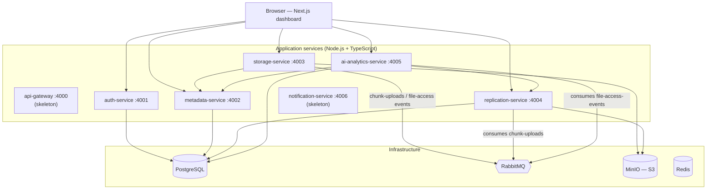
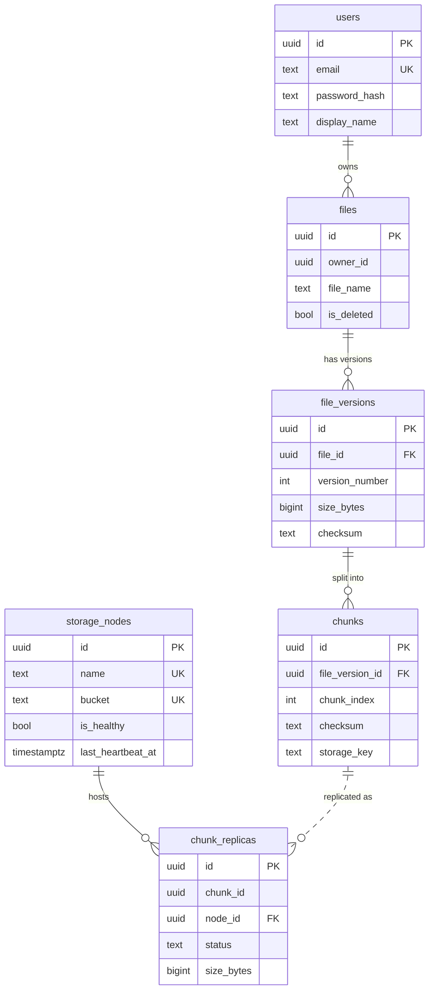
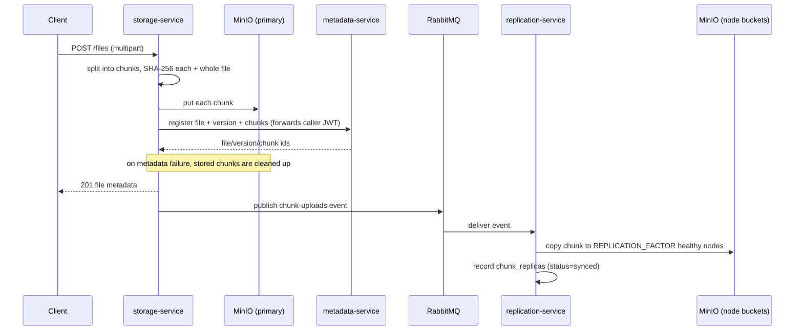
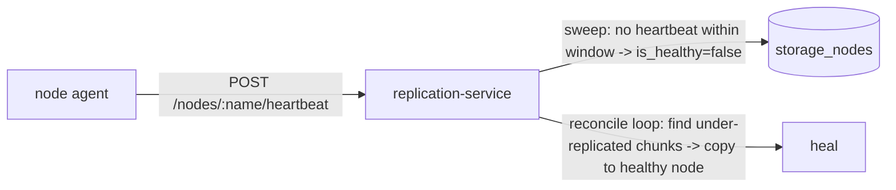

# IntelliStore — Architecture

IntelliStore is a distributed file-storage platform (think Dropbox / Amazon S3)
built as a set of Node.js/TypeScript microservices, with an AI-flavored
analytics layer that classifies files hot/cold and surfaces storage
recommendations. This document explains how the pieces fit together and *why*
they're shaped the way they are.

## Contents

- [System overview](#system-overview)
- [Services](#services)
- [Shared packages](#shared-packages)
- [Data model](#data-model)
- [Key flows](#key-flows)
- [Design decisions & rationale](#design-decisions--rationale)
- [Deliberate simplifications](#deliberate-simplifications)

## System overview

Every service is independently deployable, owns its own slice of the schema (no
shared tables across service boundaries), and talks to peers over HTTP or
RabbitMQ — never by reaching into another service's database.

## Services

| Service | Port | Responsibility | Persistence |
| ------- | ---- | -------------- | ----------- |
| **auth-service** | 4001 | User registration/login, bcrypt password hashing, JWT access/refresh issuing | Postgres (`users`) |
| **metadata-service** | 4002 | Files, versions, and chunk metadata; per-owner access control; system-wide stats | Postgres (`files`, `file_versions`, `chunks`) |
| **storage-service** | 4003 | Chunking + SHA-256 hashing of uploads, chunk persistence, download reassembly + integrity check | MinIO (chunk bytes); calls metadata-service |
| **replication-service** | 4004 | Copies chunks to simulated storage nodes, node heartbeat monitoring, self-healing reconciliation | Postgres (`storage_nodes`, `chunk_replicas`); MinIO (node buckets) |
| **ai-analytics-service** | 4005 | Hot/cold temperature scoring, cross-service analytics overview, access-count tracking | Postgres (`file_access_stats`); calls metadata + replication |
| **api-gateway** | 4000 | *Skeleton* — intended single entry point / routing / rate limiting | — |
| **notification-service** | 4006 | *Skeleton* — intended email/websocket notifications | — |
| **web** | 3000 | Next.js dashboard (auth, file table with hot/cold badges, node health, recommendations) | — |

## Shared packages

Cross-cutting concerns live in `packages/` so services don't reimplement them:

- **shared-config** — zod-validated env loading; also walks up to find the
  monorepo-root `.env` so a service run from its own directory still picks up
  shared config.
- **shared-logger** — structured logging (pino), pretty in dev.
- **shared-types** — cross-service TypeScript types (API envelope, domain
  entities, queue event shapes) so producer and consumer agree on wire formats.
- **shared-auth** — JWT sign/verify. Only auth-service signs; every other
  service verifies access tokens with the shared secret, so auth checks need no
  network hop to auth-service.
- **shared-queue** — thin amqplib wrapper (`connectWithRetry`, `publishJson`,
  `consumeJson`) used by every producer/consumer.

## Data model

The `chunks`↔`chunk_replicas` relationship crosses a service boundary
(metadata-service owns `chunks`, replication-service owns `chunk_replicas`), so
it's an application-level reference by `chunk_id`, not a database foreign key.

## Key flows

### Upload

Download reverses this: fetch chunk metadata, read chunks from MinIO, reassemble
in order, and re-verify the whole-file SHA-256 before responding (rejecting on
mismatch). A successful download also emits a `file-access-events` message that
ai-analytics-service consumes to update access counts.

### Heartbeat monitoring & self-healing

Two independent loops in replication-service:

1. **HeartbeatMonitor** — every `HEARTBEAT_SWEEP_INTERVAL_MS`, marks any node
   that hasn't heartbeat within `HEARTBEAT_STALE_MS` as unhealthy.
2. **SelfHealingService** — every `SELF_HEALING_INTERVAL_MS`, marks replicas on
   unhealthy nodes `lost`, then re-scans *all* chunks whose synced-replica count
   is below `REPLICATION_FACTOR` and copies them onto healthy nodes that don't
   already hold a copy.

Splitting "detect" from "reconcile" — and having reconcile re-scan real counts
every tick rather than react only to a node's health transition — is what lets
healing retry a chunk it couldn't repair immediately (e.g. no eligible node was
available at the time), once a node comes back.

## Design decisions & rationale

- **Repository pattern everywhere.** Services depend on repository *interfaces*,
  with a Postgres implementation for production and an in-memory fake for tests.
  Business logic is unit-tested with no database or network — fast, deterministic
  tests that still exercise real logic.
- **Cross-service JWT verification with a shared secret.** auth-service is the
  only signer; peers verify locally via `shared-auth`. This keeps auth checks
  off the hot path (no per-request call to auth-service) at the cost of a shared
  secret — an acceptable trade for this design, and swappable for asymmetric
  keys (sign with a private key, verify with a public one) without touching call
  sites.
- **Interface-segregated storage backends.** storage-service writes chunks
  through a `StorageBackend` interface with MinIO and local-filesystem
  implementations; the upload/download logic is unaware of which is active. The
  local backend is a Docker-free fallback (e.g. CI).
- **Event-driven replication.** storage-service publishes to RabbitMQ and
  returns immediately; replication happens asynchronously. A publish failure is
  logged, not surfaced — the chunk is already durably stored and registered, so
  replication is a secondary concern that self-healing will pick up anyway.
- **Control-loop self-healing.** The reconciliation design mirrors how
  Kubernetes controllers work: continuously compare desired vs. actual state and
  converge, rather than firing one-shot reactions to events.
- **Deterministic hot/cold heuristic, honestly labeled.** The "AI" scoring is
  explainable feature engineering (recency half-life decay + capped frequency),
  not a trained model — the same class of signal behind real tiering systems
  like S3 Intelligent-Tiering. See [ai-analytics scoring](#services).

## Deliberate simplifications

Called out honestly rather than hidden:

- **Storage nodes are simulated as separate MinIO buckets** in one MinIO
  instance, not physically distinct servers. The replica-tracking model is
  written so swapping in real per-node S3 endpoints would only change
  `NodeStorage` configuration, not the replication logic.
- **api-gateway and notification-service are skeletons** (health check only).
  The gateway's intended job — a single ingress origin — is also what a
  production frontend deployment needs (see [DEPLOYMENT](./DEPLOYMENT.md)).
- **Secrets are committed dev defaults** for a friction-free local/minikube run;
  a real deployment sources them from a secrets manager.
- **Encryption, compression, dedup, and file sharing** from the original wishlist
  are not implemented; the chunk/version data model leaves room for them (e.g.
  content-addressed `storage_key`s would enable dedup).
